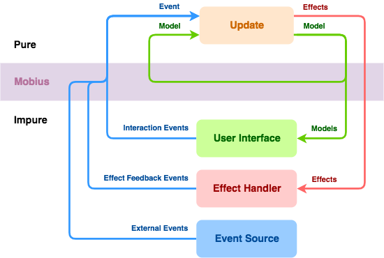

This document is intended as a quick overview of the core concepts in Mobius. The terms have detailed explanations in the Reference Guide section of the wiki, but it's best to familiarise yourself with this overview before going in depth.

## Mobius Loop
A Mobius loop is a part of an application, usually including a user interface. In a Spotify context, there is usually one loop per feature such as “the album page”, “login flow”, etc., but a loop can also be UI-less and for instance be tied to the lifecycle of an application or a user session.



> A Mobius loop receives [Events](Event), which are passed to an [Update](Update) function together with the current [Model](Model). As a result of running the Update function, the Model might change, and [Effects](Effect) might get dispatched. The Model can be observed by the user interface, and the Effects are received and executed by an [Effect Handler](Effect-Handler).

'Pure' in the diagram refers to pure functions, functions whose output only depends on their inputs, and whose execution has no observable side effects. See [Pure vs Impure Functions](Pure-vs-Impure-Functions) for more details.

## Event
Events occur in and around the loop and act as triggers for state-changing business logic, for example:

- User actions in the UI, such as submitting a query by typing into a text field, or clicking on a checkbox.
- Responses from backend services.
- System events like changes in network availability.

Events in Mobius are implemented as [immutable](Immutability) data objects.

Events often have different payloads (or no payload). So a `QueryUpdated` event almost certainly has the actual query string attached, whereas a `ClearHistory` event probably doesn’t need any payload. A `SearchResultReceived` event includes the response from the search backend, and so on.

## Model
The model is an immutable representation of the loop’s state from a business logic perspective - that is, decoupled from the UI. The Model and the Event must contain all the data that the Update function needs in order to make decisions when an Event happens, since the Update function must be pure and therefore cannot read state externally.

What’s presented in the UI should be derivable from the model, but it doesn’t have to be identical. So concatenated strings, formatted dates, etc., don’t need to be included in the model. Instead they can be calculated when the UI is updated.

> Note: The expression “from a business logic perspective” means that `canLogin` is a good name for a field in the model, but `loginButtonEnabled` is not. The latter is more appropriate in the UI.

## Effect
Sometimes, you need to change or fetch information that currently isn’t in the Model (for example, data that resides in a backend service). You do this in Mobius with Effects. The term ‘Effect’ was chosen because it is similar to ‘side effect’.

'Effect' in Mobius is a *description* of a desired impure function invocation, not the invocation itself. You can think of it as a statement that "I want to send a search request with the query string 'foo'", and not than an invocation of `api.search("foo")`. We sometimes distinguish between Effect description (immutable messages) and Effect execution (making the desired Effect actually happen).

The difference between Events and Effects is that Events are external things that happen and are inputs to the Mobius loop, whereas Effects are outputs from the Mobius loop; things the loop wants to do in the outside world. 

A common example of an Effect is sending a backend request. Even if this doesn’t mutate any state, it’s still an impure function as it involves a network call, and leads to different results depending on the network connection and the current state of the backend services.

Similar to Events, Effects normally have different payloads depending on what they describe. An `AttemptLogin` Effect would include a username and password, and an `UpdateAddress` effect would contain the new address data.

## Update Function
This is the heart of a Mobius loop. It has the following signature:

```java
Next<M, F> update(M model, E event)
```

Picking that apart, the method takes a Model with the current state and an Event, and returns a `Next` object. The `Next` object may contain a new Model if the state should be changed for the next Update invocation, and always has a (possibly empty) set of Effects that should be triggered. Update functions must be pure.

The Update function is declarative, in the sense that it declares what should happen, but doesn’t actually do anything itself. It returns a `Next` that describes the desired changes - possibly a new Model, and possibly some Effects that should be executed - but actually changing the Model and executing the Effects happens elsewhere.

For each incoming Event, Mobius invokes the Update function and atomically replaces the Model (if the Update function specifies that a new one is needed) before handling the next Event. This sequencing of Events, combined with the immutability of Events, Effects and Models, means that there are no data races in the loop itself.

## Starting and resuming a loop
You frequently need to start things when initialising or resuming a Mobius loop. This can entail firing off requests to load data, etc. Mobius supports two ways for doing this, either through passing in a set of initial effects to `MobiusLoop.startFrom(M model, Set<F> startEffects)`, or through the Init function, which has the following signature:

```java
First<M, F> init(M model)
```

That is, given a Model, it returns a Model and a set of Effects to run.

The Model that Init gets invoked with is normally either a 'starting' Model, or a 'saved' Model that has been restored. Init may return the Model unchanged, or change it, and it may also return Effects that kick off things that allow the loop to make progress. 

An example: if a loop is paused in an Error state because loading data from the backend has failed and then resumed, the Init function can return a Loading state and an Effect that retries the backend request.

The recommendation is to use the Init function together with MobiusController, as it is mostly useful for loops that get started and stopped; for one-shot loops, passing in a set of initial effects to run is easier.

## Effect Handler
Once the Update function has dispatched an Effect, something needs to execute it. That is the job of Effect Handlers. An Effect Handler consumes Effects and (usually) produces Events.

A common example of an Effect Handler task is to send a request to a backend service and when a response arrives, translate the response into an Event for the Update function. Effect Handlers are not allowed to throw exceptions, instead they should convert errors into Events that the Update function can react to (eg. triggering a fallback mechanism or giving the user feedback).

## UI
Building user interfaces (not necessarily graphical) is what Mobius has been created to do, but UIs are optional. It's often a good idea to build a UI-less Mobius loop for managing the state evolution of something without a user interface.

The primary way of connecting your UI to the business logic in the Update function is by observing Model changes. Each time the Model changes, the UI will get notified and can update its state accordingly. This means that the UI is similar to an Effect Handler, but consumes Models (not Effects) while still producing Events. Typically, parts of the Model will be bound to widgets ("views" in Android parlance) in the UI, so that a `boolean` field in the Model can enable or disable a button, etc.

## Where Next?

If you would like a hands-on example, take a look at the [Getting Started guide](Creating-a-loop), and if you prefer understanding more of the theory, then continue learning more about the [objectives](Objectives) of Mobius.